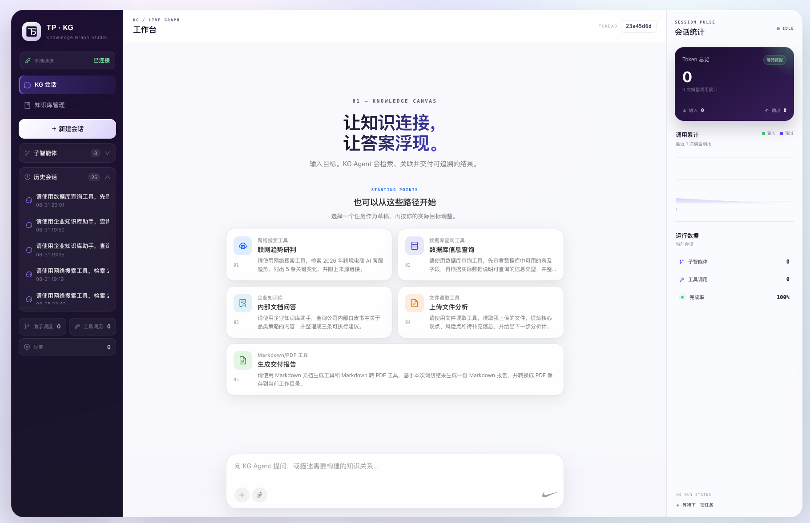
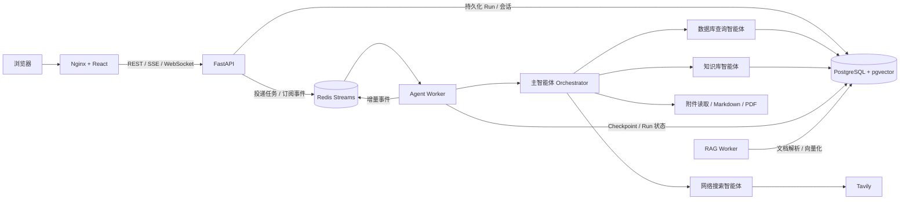

<div align="center">
  <h1>KG Harness</h1>
  <p><strong>面向深度研搜任务的可观察、多智能体协作工作台</strong></p>
  <p>让主智能体规划任务，让专家智能体检索公开网络、结构化数据库与私有知识库，最后交付可下载的研究文档。</p>

  <p>
    
    
    
    
    
  </p>
</div>

> [!IMPORTANT]
> 项目仍在持续优化中，当前更适合个人研究、架构学习和可信网络内的部署，可以进行二次开发。



## 为什么做 KG Harness

真实研究任务通常不是一次模型问答，而是一条包含规划、检索、判断、写作和交付的执行链。例如：

> 结合最新公开资料、业务数据库和我上传的行业报告，分析机器人赛道并生成一份带引用的 PDF。

KG Harness 将这类任务拆给不同角色：主智能体负责理解需求、调度与汇总；网络搜索、数据库查询和企业知识库智能体分别获取证据；文件工具读取附件并生成 Markdown / PDF。前端通过可重连 SSE 展示公开执行轨迹、工具调用、Token 用量和最终产物，不展示模型隐藏思维链。

## 核心能力

- **Orchestrator–Workers 多智能体架构**：一名主智能体调度网络搜索、数据库查询和知识库检索三个专家智能体。
- **多源证据检索**：集成 Tavily、PostgreSQL、pgvector、全文检索、RRF 融合与 reranker，而不是依赖模型记忆直接回答。
- **从问题到交付物**：读取 PDF、Word、Excel、Markdown 与文本附件，输出 Markdown，并可转换为 PDF。
- **长任务可观察**：任务队列、节点状态、子智能体/工具调用、增量回答和 Token 统计通过 SSE 实时呈现。
- **可恢复执行面**：PostgreSQL 持久化会话、Run 与 LangGraph Checkpoint；Redis Streams 承载队列、事件、取消信号和 Worker 注册。
- **会话隔离**：使用 `thread_id`、`run_id`、`tenant_id` 和独立工作目录隔离上下文、附件与生成文件。

## 系统架构



一次任务的主链路：

```text
用户提交任务
  → FastAPI 持久化 Run
  → Redis Streams 进入执行队列
  → Agent Worker 领取任务
  → 主智能体规划并调度专家智能体
  → 汇总多源证据并生成交付物
  → Redis 记录可回放事件，PostgreSQL 收敛最终状态
  → 前端通过 SSE 展示过程、答案与文件
```

更完整的组件边界、失败语义和演进设计见 [企业执行架构](docs/enterprise-architecture.md)；代码导读见 [项目架构与面试指南](docs/project-architecture-and-interview-guide.md)。

## 技术栈

| 领域 | 组件 | 用途 |
| --- | --- | --- |
| Agent Runtime | DeepAgents、LangGraph、LangChain | 主/子智能体编排、工具调用、流式执行与 Checkpoint |
| API | FastAPI、Uvicorn | 任务、会话、上传、下载、RAG 与健康检查接口 |
| 执行队列 | Redis Streams | Run 队列、Consumer Group、取消、租约和短期事件流 |
| 数据与检索 | PostgreSQL 17、pgvector、FTS、RRF | 会话与 Run 持久化、向量/稀疏混合检索 |
| 外部检索 | Tavily | 最新公开网络资料搜索 |
| 文档处理 | pypdf、python-docx、pandas、ReportLab | 附件解析和 Markdown / PDF 交付 |
| Web | React 19、TypeScript、Vite、Ant Design、Nginx | 研究工作台与生产静态站点 |
| 工程化 | uv、pnpm、Docker Compose | 依赖锁定、构建与部署 |

## 快速开始

### 环境要求

- 一台安装了 Docker Engine 与 Docker Compose v2 的 Linux 服务器
- 建议至少 4 核 CPU、6 GB 内存和 20 GB 可用磁盘
- 一个 OpenAI 兼容的大模型 API Key
- 可选：Tavily API Key（不配置时无法使用公开网络搜索）

### 1. 获取项目

```bash
git clone https://github.com/TP-mimanchi/kgharness.git
cd kgharness
cp .env.example .env
```

### 2. 配置密钥

编辑 `.env`，至少替换以下值：

```dotenv
OPENAI_API_KEY=your-model-api-key
POSTGRES_PASSWORD=your-long-random-postgres-password
REDIS_PASSWORD=your-long-random-redis-password
TAVILY_API_KEY=your-tavily-api-key
```

可用下面的命令生成数据库密码：

```bash
openssl rand -hex 24
```

如果使用 DashScope，可继续使用默认兼容接口和模型名，或改为 `DASHSCOPE_BASE_URL`、`DASHSCOPE_API_KEY`。其他 OpenAI 兼容服务请同步修改 `OPENAI_BASE_URL` 与 `LLM_QWEN_MAX`。

### 3. 一键启动

```bash

docker compose --env-file .env -f docker/compose.yaml up -d
```

脚本会检查配置、构建镜像、启动完整服务，并等待 `/health/ready` 就绪。完成后访问：

```text
http://<服务器 IP>:80
```

如需修改端口，在 `.env` 中设置 `APP_PORT`。生产 Compose 不向宿主机暴露 PostgreSQL 和 Redis，只开放 Web 入口。

## 配置说明

| 变量 | 必填 | 默认值 | 说明 |
| --- | --- | --- | --- |
| `OPENAI_BASE_URL` | 是 | DashScope 兼容地址 | OpenAI 兼容模型接口 |
| `OPENAI_API_KEY` / `DASHSCOPE_API_KEY` | 是 | — | 模型访问密钥，二选一 |
| `LLM_QWEN_MAX` | 是 | `deepseek-v4-flash` | 主智能体与专家智能体使用的模型 |
| `TAVILY_API_KEY` | 否 | — | 公开网络搜索；深度研搜建议配置 |
| `POSTGRES_PASSWORD` | 是 | — | PostgreSQL 密码 |
| `REDIS_PASSWORD` | 是 | — | Redis 密码 |
| `APP_BIND_ADDRESS` | 否 | `0.0.0.0` | Web 服务监听地址 |
| `APP_PORT` | 否 | `80` | Web 服务宿主机端口 |
| `AGENT_WORKER_CONCURRENCY` | 否 | `2` | 单个 Agent Worker 并发任务数 |
| `RAG_EMBEDDING_MODEL` | 否 | `text-embedding-v3` | 知识库向量模型 |
| `RAG_EMBEDDING_DIMENSION` | 否 | `1024` | 向量维度，必须与模型输出一致 |
| `RAG_RERANK_MODEL` | 否 | `qwen3-rerank` | 检索重排模型 |

Compose 会为容器注入内部 PostgreSQL/Redis 地址；`.env` 中以 `localhost` 为主机的 `RAG_DATABASE_URL`、`BUSINESS_DATABASE_URL` 与 `REDIS_URL` 用于本地开发。


扩容 Agent Worker：

```bash
docker compose --env-file .env -f docker/compose.yaml up -d --scale agent-worker=2
```

> [!CAUTION]
> `docker compose down -v` 会删除 PostgreSQL、Redis、RAG、上传文件和生成文件数据卷。

## 本地开发

### 启动基础设施

开发 override 仅把数据库端口绑定到 `127.0.0.1`：

```bash
cp .env.example .env
# 编辑 .env 中的模型和数据库密钥
docker compose --env-file .env \
  -f docker/compose.yaml \
  -f docker/compose.dev.yaml \
  up -d postgres redis
```

### 启动后端

```bash
uv sync
RUN_EXECUTION_MODE=local uv run uvicorn app.api.server:app \
  --host 0.0.0.0 --port 8000 --reload
```

`local` 模式在 API 进程内执行 Agent，便于调试。要复现生产队列模式，请将 `RUN_EXECUTION_MODE` 设为 `distributed`，并另行启动 `uv run python -m app.agent.worker`。

### 启动前端

```bash
cd frontend
pnpm install
pnpm dev
```

打开 `http://localhost:5173`。前端开发服务器默认连接 `http://localhost:8000`。

### 运行检查

```bash
uv run pytest
cd frontend && pnpm build
```

## 主要接口

| 方法 | 路径 | 说明 |
| --- | --- | --- |
| `POST` | `/api/task` | 创建研究任务 |
| `GET` | `/api/runs/{run_id}` | 查询持久化 Run 状态 |
| `GET` | `/api/runs/{run_id}/events` | 订阅可重连、可回放 SSE 事件 |
| `POST` | `/api/runs/{run_id}/cancel` | 取消分布式任务 |
| `POST` | `/api/upload` | 上传会话附件 |
| `GET` | `/api/files` | 列出生成文件 |
| `GET` | `/api/download` | 下载生成文件 |
| `POST` | `/api/v1/knowledge-bases` | 创建知识库 |
| `POST` | `/api/v1/retrieval/search` | 执行知识库检索 |
| `GET` | `/health/live` | 进程存活探针 |
| `GET` | `/health/ready` | PostgreSQL、Redis、Worker 与队列就绪探针 |

启动后可通过 `http://localhost/docs` 查看完整 OpenAPI 文档。

## 项目结构

```text
kgharness/
├── app/
│   ├── agent/                 # 主智能体、专家智能体与 Agent Worker
│   ├── api/                   # FastAPI、SSE、上传下载与健康检查
│   ├── chat/                  # 会话消息和持久化 Run 仓储
│   ├── core/                  # 配置、PostgreSQL 连接池、Redis Streams
│   ├── rag/                   # 入库 Worker、LangGraph RAG 与混合检索
│   ├── services/              # 执行、重试、取消和终态收敛
│   └── tools/                 # 网络、数据库、附件、Markdown、PDF 工具
├── docker/
│   ├── compose.yaml           # 可部署的完整生产栈
│   └── compose.dev.yaml       # 本地基础设施端口 override
├── docs/                      # 架构与项目文档
├── frontend/                  # React + Vite 工作台与 Nginx 镜像
├── tests/                     # 执行面与 RAG 测试
├── Dockerfile                 # Python API / Worker 共用镜像
├── deploy.sh                  # 一键部署与运维入口
└── pyproject.toml             # Python 依赖与测试配置
```

## 安全边界

- PostgreSQL 与 Redis 默认只位于 Docker 内部网络；不要在公网开放 `5432` 或 `6379`。
- `.env` 已被忽略，请勿提交模型、搜索、数据库或 Redis 密钥。
- 数据库查询智能体只接受只读 SQL，但生产环境仍应使用只读数据库账号和独立 schema 权限。
- 当前项目没有完整的用户登录与授权系统。公网部署前应在反向代理或应用层加入认证，并启用 HTTPS。
- 上传内容和生成文件会持久化到 Docker volume；请按数据敏感级别配置备份、保留周期和磁盘加密。

## Roadmap

- [ ] 用户认证、团队空间与细粒度租户权限
- [ ] 引用质量评估、证据覆盖率与研究任务 Evals
- [ ] 可视化 Agent 拓扑和人工审批节点
- [ ] OpenTelemetry 指标、链路追踪与告警模板
- [ ] S3 兼容对象存储和产物生命周期管理
- [ ] CI 镜像发布与版本化数据库迁移

## 参与贡献

Issue、讨论和 Pull Request 都欢迎。提交代码前请运行后端测试与前端构建，并避免在日志、Fixture 或截图中包含真实密钥和业务数据。

如果这个项目对你理解多智能体深度研搜、可恢复 Agent Runtime 或 RAG 工程化有帮助，欢迎 Star。
