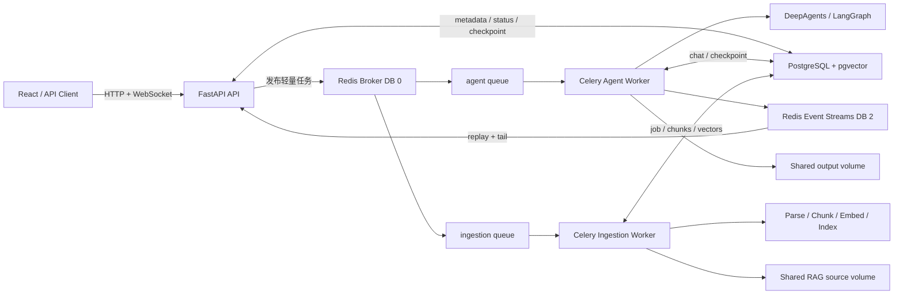
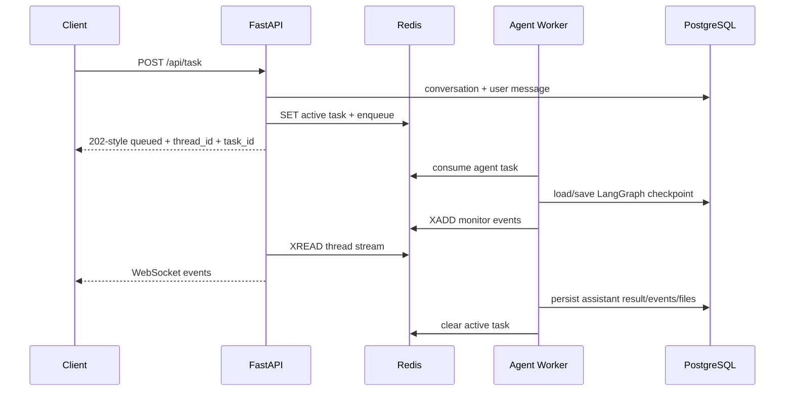
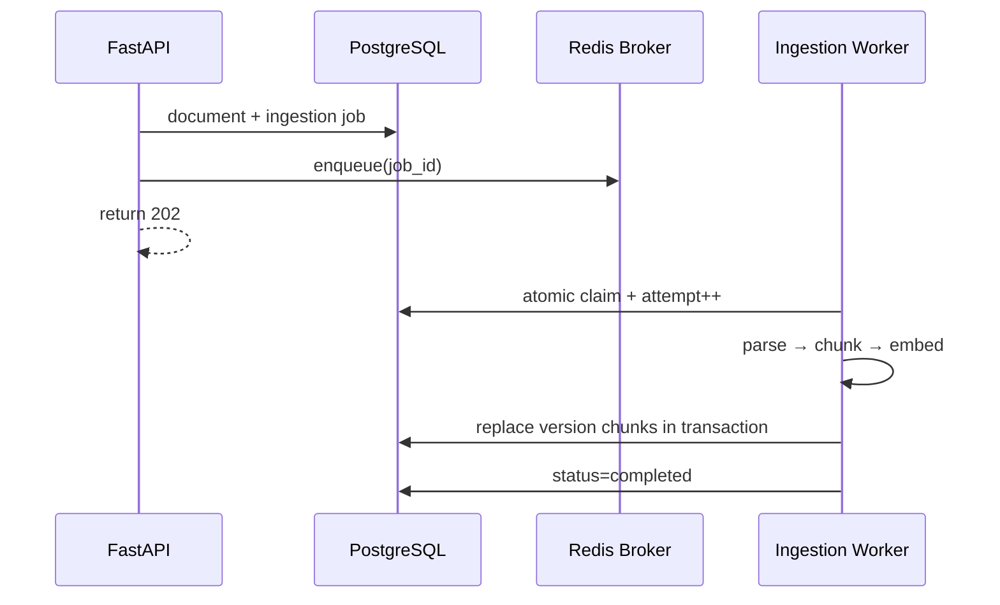

# kgharness 小型企业级 Agent + RAG 升级方案

## 1. 结论

项目不需要重写成微服务。当前最合适的形态是 **模块化单体代码库 + 独立 API/Worker 进程 + PostgreSQL 业务事实源 + Redis 短期协调层**。

第一阶段目标链路：



Redis 不是业务事实源：队列消息、Celery 结果和 24 小时事件流可以过期；会话、作业状态、文档元数据、向量、Agent checkpoint 必须留在 PostgreSQL。

## 2. 当前项目架构盘点

### 已具备的基础

- FastAPI、React/Vite、WebSocket 完整前后端闭环。
- DeepAgents 主 Agent + 网络、数据库、知识库三个子 Agent。
- LangGraph PostgreSQL checkpointer，支持会话记忆恢复。
- 自研 RAG：租户字段、知识库/文档/作业模型、pgvector HNSW、PostgreSQL 全文检索、RRF 融合、DashScope rerank、证据引用。
- 文档摄取作业有持久状态、进度、重试次数和 `FOR UPDATE SKIP LOCKED` 认领逻辑。
- 文件路径边界、只读 SQL 校验、上传大小限制等基础安全控制。

### 升级前的关键缺口

| 领域 | 升级前 | 风险 |
| --- | --- | --- |
| Agent 调度 | FastAPI 内 `asyncio.create_task` | API 重启即丢失执行权；无法跨副本取消/查询 |
| RAG 调度 | Worker 轮询 PostgreSQL | 空轮询；队列能力、路由和监控不足 |
| 实时事件 | API 进程内字典 + WebSocket | Worker 独立后无法通信；重连丢事件 |
| 工作负载隔离 | Agent 与摄取没有正式队列边界 | 大文档 embedding 可挤占交互任务 |
| 健康检查 | 只检查 PostgreSQL | Redis/broker 故障仍可能显示健康 |
| 部署 | Compose 只有 API、轮询 Worker、PG | 缺 broker、结果后端、队列 Worker 和运维面 |
| 企业身份 | `X-Tenant-ID` 可由客户端直接指定 | 不是可信认证，存在租户冒用风险 |
| 对象存储 | 本机/Named Volume | 单机可用，不能直接跨主机扩容 |
| 可观测性 | print + 前端事件 | 缺指标、trace、结构化日志和告警 |

## 3. 两个 GitHub 参考项目

### Onyx

仓库：<https://github.com/onyx-dot-app/onyx>

可借鉴：

- API、Celery Worker、Celery Beat 独立部署，Worker 按职责拆分并可独立扩容。
- Redis broker 与 result backend 使用不同逻辑库；启用启动重连、健康检查、socket keepalive、任务优先级和 `acks_late`。
- 生产配置考虑 Redis TLS、Sentinel、密码编码、结果过期和 broker 连接池。
- PostgreSQL、Redis、索引服务、对象存储各司其职；Kubernetes 环境支持 HPA/KEDA。
- 每个 Celery 任务携带 tenant 上下文，并在任务结束后清理进程上下文，防止串租户。

本项目第一阶段采用其中的队列隔离、late ack、低 prefetch、健康检查、结果过期和独立 Worker；暂不照搬 Onyx 的多种索引服务、Redis Sentinel 和 Kubernetes 复杂度。

### ApeRAG

仓库：<https://github.com/apecloud/ApeRAG>

可借鉴：

- FastAPI 只写入期望状态并快速返回；Celery 执行解析与索引任务。
- `TaskScheduler` 抽象隔离业务逻辑和任务系统，Celery 入口只负责序列化、重试与回调。
- 文档索引采用数据库状态 + version/observed_version 的调谐模型，避免旧任务覆盖新版本。
- 复杂索引用 Celery `chain + group + chord` 实现“解析一次、多个索引并行、结果聚合”。
- 任务级自动重试、索引级部分成功、版本校验和定时 reconciler 共同实现最终一致性。

本项目第一阶段先做“任务入口薄层 + 数据库状态 + 原子认领”；第二阶段再为重建/删除加入版本号与 reconciler，等确实增加 Graph/全文独立索引时再使用 chord。

## 4. 已实施的第一阶段

### 进程与队列

- `FastAPI`：只负责参数/租户头校验、写入用户消息、发布任务、查询/取消任务和转发事件；强身份认证列入 P1。
- `agent-worker`：只消费 `agent` 队列，单进程并发 1，运行 DeepAgents/LangGraph 长任务。
- `ingestion-worker`：只消费 `ingestion` 队列，默认并发 2，执行解析、切块、embedding 和索引。
- `flower`：仅在 `ops` profile 启用，并只绑定服务器 `127.0.0.1`。

### Celery 可靠性参数

- JSON-only 序列化，禁止 pickle 消息。
- `task_acks_late=True`、`task_reject_on_worker_lost=True`。
- `worker_prefetch_multiplier=1`，避免一个 Worker 预占多个长任务。
- soft/hard time limit 默认 55/60 分钟。
- Redis visibility timeout 大于 hard limit，降低任务执行中被重复投递的概率。
- Agent 不自动重试，避免重复写交付物；摄取任务最多重试 2 次，并由 PostgreSQL `attempt/status` 记录实际状态。

### 跨进程事件

每个 thread 使用 `kgharness:events:{thread_id}` Redis Stream：

- Worker 用 `XADD MAXLEN` 写事件。
- FastAPI WebSocket 用 `XREAD` 从 `0-0` 回放并持续读取。
- Stream 限长 1000 条、默认保留 24 小时。
- PostgreSQL `chat_messages.events` 保存最终完整历史，Redis 只服务运行中与短期重连。

### RAG 作业一致性

- `rag_ingestion_jobs` 增加 `celery_task_id`。
- 上传事务完成后只向 Celery 传递 `job_id`，不把文件内容塞进 Redis。
- Worker 通过指定 job id 原子认领，仅 `queued/retry` 或锁超时的任务可运行。
- broker 发布失败时将作业标成 `dispatch_failed`，用户可显式 retry，不制造“永远 queued”的幽灵作业。

### Async 运行时适配

现有数据库仓储和 LangGraph 都是 async，而 Celery 任务入口是同步函数。每个 Worker 子进程使用一个持久 asyncio loop 线程，连接池和 checkpointer 始终绑定同一事件循环，避免每个任务 `asyncio.run()` 后关闭 loop 导致连接池复用错误。

## 5. 关键执行流

### Agent



### RAG 摄取



## 6. `119.91.123.102` Docker 部署

### 安全边界

- 公网安全组只开放 `22`（限制管理 IP）以及 `80/443`。
- 不开放 `5432`、`6379`、`5555` 到公网。
- PostgreSQL 与 Redis 仅加入 Compose 的 internal `data` 网络。
- Flower 映射到 `127.0.0.1:5555`，通过 SSH tunnel 访问。
- `.env` 权限设为 `600`；PostgreSQL/Redis 密码建议使用至少 32 位字母数字串，避免 Compose URL 中的 URI 保留字符。
- 当前 Compose 是单机容灾边界；数据卷需要服务器级快照/备份。

### 建议规格

试点环境建议至少 `4 vCPU / 8 GB RAM / 80 GB SSD`。默认容器内存上限总和约 5 GB，剩余空间留给 Docker、文件解析峰值与页缓存。若服务器只有 4 GB，先把 ingestion concurrency 调为 1，并下调各容器限制。

### 启动

```bash
cd /opt/kgharness
cp .env.example .env
chmod 600 .env
# 编辑真实模型密钥、POSTGRES_PASSWORD、REDIS_PASSWORD、CORS_ALLOWED_ORIGINS

docker compose --env-file .env -f docker/compose.yaml config
docker compose --env-file .env -f docker/compose.yaml up -d --build
docker compose --env-file .env -f docker/compose.yaml ps
curl --fail http://127.0.0.1/health
```

启用 Flower：

```bash
docker compose --profile ops --env-file .env -f docker/compose.yaml up -d flower
ssh -L 5555:127.0.0.1:5555 user@119.91.123.102
```

浏览器访问 `http://127.0.0.1:5555/flower`。

### 备份最低要求

- PostgreSQL：每日 `pg_dump` + 云盘快照，至少保留 7 天，并定期做恢复演练。
- Redis：已开启 AOF everysec，但不把它当业务备份；丢失时允许重发未完成任务。
- `rag-data`、`agent-output`、`agent-upload`：纳入云盘快照；第二阶段迁入 S3/MinIO。

## 7. 后续路线图

### P1：上线前必须补齐

1. JWT/OIDC 身份认证，从 token 派生 tenant，不再信任任意 `X-Tenant-ID`。
2. chat conversation/message 增加 `tenant_id` 和成员权限过滤。
3. Alembic 管理 schema；禁止生产启动时由 API 动态执行 DDL。
4. Nginx/Caddy TLS、请求体限制、访问日志和限流。
5. Prometheus 指标：队列深度、等待时长、任务耗时、失败率、embedding/LLM 延迟与 token 成本。
6. Agent run 表和幂等键，确保 Worker crash/redelivery 不重复落助手消息。

### P2：规模增长后

1. 文件转 S3/MinIO，API 与 Worker 无需同主机 volume。
2. 文档/索引引入 `version/observed_version` 与定时 reconciler。
3. 摄取拆为 parse、embed、index 阶段；只有确有并行索引收益时使用 Celery chain/group/chord。
4. Redis 使用托管服务或 Sentinel，启用 TLS；PostgreSQL 使用托管高可用实例。
5. OpenTelemetry + Sentry/日志平台，统一 `request_id/thread_id/task_id/tenant_id`。

### P3：不应过早引入

- Kubernetes、KEDA、多区域、GraphRAG、独立 OpenSearch 集群。
- 触发条件应是单机资源不足、明确 SLA、数据量/吞吐量证明 pgvector 或 Compose 已成为瓶颈，而不是为了“架构看起来企业级”。

## 8. 验收指标

- API 发布任务 P95 小于 300 ms（不含上传）。
- API 重启不终止 Worker 中的任务，前端重连能回放最近事件。
- Agent 与 ingestion 队列互不抢占 Worker。
- Worker 异常退出后未确认任务可重新投递，摄取作业不会并发重复认领。
- broker 不可用时 API 返回 503，RAG 作业明确进入 `dispatch_failed`。
- PostgreSQL/Redis 任一不可用时 `/health` 返回 503。
- 单元测试、导入检查、Compose 配置检查全部通过后才部署。
