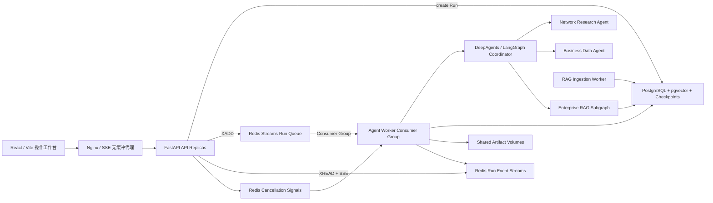
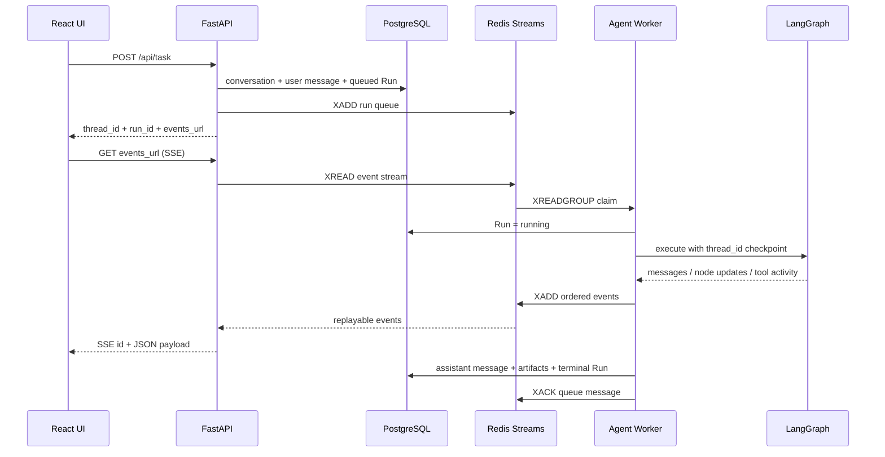

# kgharness 企业级目标架构

本文描述当前仓库已经落地的第一阶段架构，以及继续扩展到多主机生产环境时的边界。

## 设计原则

- PostgreSQL 是业务真相：保存会话、Run 状态、LangGraph Checkpoint、RAG 元数据和 pgvector。
- Redis 是执行传输层：保存待执行消息、消费者租约、取消信号和短期事件流，不保存唯一业务数据。
- API 不执行 Agent：分布式模式下只校验请求、创建 Run、写数据库和投递队列。
- Agent Worker 可横向扩容：使用 Redis Streams Consumer Group 竞争 Run，并定期续约消息租约。
- 每次执行有独立 `run_id`；多轮对话使用稳定的 `thread_id`，二者不可混用。
- 前端通过 SSE 按 Redis Stream ID 重连和回放；旧 WebSocket 仅作为本地模式兼容接口。

## 已实现架构

## Run 生命周期

## 事件契约

前端只展示可审计的运行信息，不展示隐藏思维链。当前关键事件包括：

| 事件 | 用途 |
| --- | --- |
| `run_queued` / `run_started` | 队列和 Worker 生命周期 |
| `message_delta` | 最终回答的可见 Token/文本增量 |
| `reasoning_delta` | 模型显式提供的过程摘要；前端默认不渲染为内部思维链 |
| `node_completed` | LangGraph 节点完成 |
| `assistant_call` | 主 Agent 向专业 Agent 交接 |
| `tool_start` | 工具调用开始 |
| `session_created` | 本次执行工作目录 |
| `task_result` | 最终用户答案 |
| `run_completed` / `run_failed` / `run_cancelled` | Run 终态 |

Redis Stream ID 同时作为 SSE `id`。浏览器重连会携带 `Last-Event-ID`，API 从该位置继续读取，不重复消费整条轨迹。

## 数据归属

| 数据 | 当前存储 | 保留策略 |
| --- | --- | --- |
| 会话与消息 | PostgreSQL | 长期 |
| Run 元数据与终态 | PostgreSQL `agent_runs` | 长期，可审计 |
| LangGraph Checkpoint | PostgreSQL | 按会话策略清理 |
| RAG 文档、Chunk、向量 | PostgreSQL + pgvector | 长期、租户隔离 |
| Run 队列与消费者租约 | Redis Stream | 短期执行数据 |
| 实时事件 | Redis Stream | 默认 24 小时、最多 2000 条/Run |
| 上传与产物 | Docker 共享卷 | 当前单主机；跨主机需迁移对象存储 |

## 部署边界与后续阶段

第一阶段适合 API、Agent Worker、RAG Worker 和 PostgreSQL 位于同一 Docker/Kubernetes 集群，Redis 使用受保护的远程实例。

要达到完整企业生产标准，后续还必须完成：

1. 使用 OIDC/OAuth2 接入企业身份，服务端从 Token 推导 `tenant_id`，禁止信任浏览器自行传入租户头。
2. 把上传与生成文件迁移到 S3/MinIO/OSS，并使用短期签名 URL；否则不同主机 Worker 无法共享文件。
3. Redis 仅通过安全组、VPN/VPC 或 TLS 暴露，启用 ACL、密码轮换和持久化策略，禁止公网匿名访问 6379。
4. 增加 Prometheus/OpenTelemetry、队列积压告警、Run 延迟、模型 Token/成本和 RAG 命中率指标。
5. 增加幂等键、失败重试上限、死信队列和人工重放；外部写工具必须具备业务幂等性。
6. 对工具参数、检索证据和事件 payload 做分级脱敏，避免 SSE 或历史轨迹泄露秘密。

