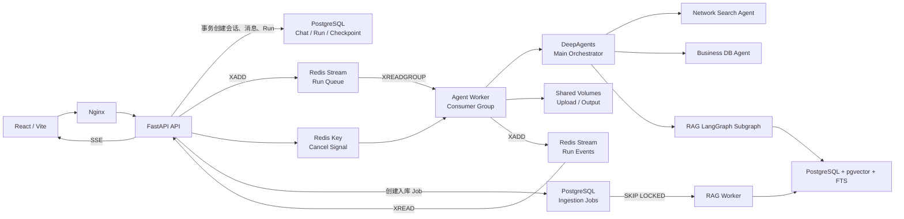
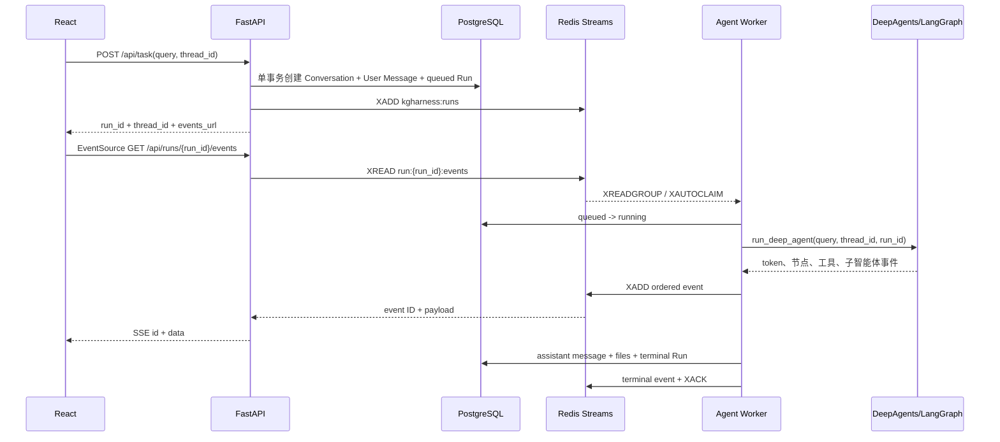
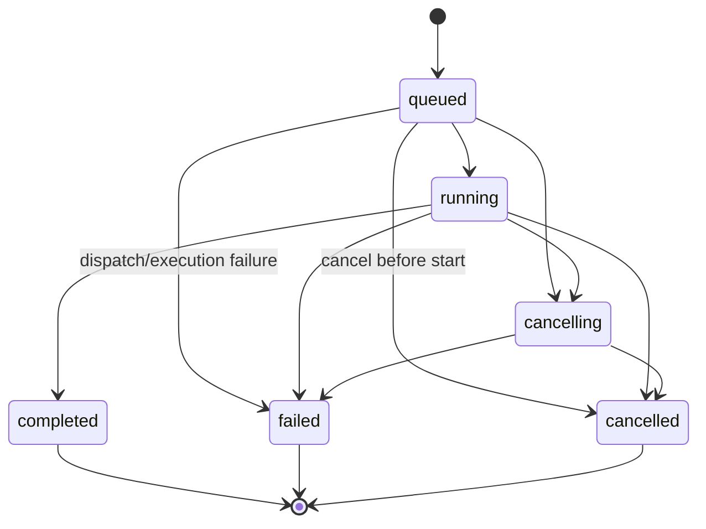
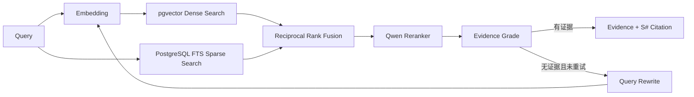

# kgharness 项目架构分析与面试知识点

> 分析范围：当前仓库代码，而不是只依据 README 或目标架构描述。  
> 核心结论：项目存在 `local` 和 `distributed` 两套执行模式。生产导向的分布式主链路是 **Redis Streams + SSE**，不是 Redis Streams + WebSocket；本地兼容链路才是 **进程内 asyncio.Task + WebSocket**。

## 1. 一句话定位

kgharness 是一个面向深度研究与企业知识检索的多智能体应用：React 前端提交长任务，FastAPI 创建持久化 Run，独立 Agent Worker 通过 Redis Streams 消费任务，DeepAgents/LangGraph 调度网络搜索、业务数据库和企业 RAG 三类专家能力，执行事件写回 Redis Stream 并通过 SSE 推送给浏览器，最终会话、Run、Checkpoint、RAG 元数据和向量落在 PostgreSQL/pgvector。

## 2. 到底是不是 Redis Stream + WebSocket

### 2.1 准确答案

不能简单回答“是”。更准确的说法是：

| 运行模式 | 任务调度 | Agent 执行位置 | 实时事件通道 | 是否可跨进程 | 是否可回放 |
| --- | --- | --- | --- | --- | --- |
| `distributed` | Redis Streams | 独立 `agent-worker` | Redis Event Stream → FastAPI → SSE | 是 | 是，受 Stream 长度和 TTL 限制 |
| `local` | `asyncio.create_task` | FastAPI 进程内 | Monitor → WebSocket | 否 | WebSocket 本身不可回放 |

补充两个容易混淆的点：

1. `app/core/config.py` 的默认模式是 `local`，但 `docker/compose.yaml` 明确把 API 和 Agent Worker 配置成 `distributed`。所以“代码默认启动”和“容器化目标部署”不是同一个答案。
2. 前端同时保留了 WebSocket 和 SSE：没有 `currentRunId` 时连接 WebSocket；分布式任务创建成功并返回 `run_id` 后，前端关闭 WebSocket，切换到该 Run 的 SSE。

### 2.2 为什么分布式模式不能依赖当前 WebSocket

WebSocket 连接保存在 FastAPI 进程内的：

```text
ConnectionManager.active_connections: dict[thread_id, WebSocket]
```

但分布式模式下，真正执行 Agent 的是另一个 `agent-worker` 进程。Worker 无法访问 API 进程内存里的 WebSocket 对象。因此跨进程事件必须先进入共享中间件 Redis，再由持有客户端连接的 API 进程转发。

当前代码正是这样实现的：

```text
Agent Worker
  -> monitor._emit(...)
  -> Redis XADD run:{run_id}:events
  -> FastAPI XREAD
  -> StreamingResponse(text/event-stream)
  -> Browser EventSource
```

WebSocket 端点仍然存在于 `app/api/server.py`，Nginx 也保留了 `/ws/` 反向代理，但它主要服务于 `local` 模式兼容，而不是分布式主链路。

## 3. 总体架构



## 4. 各层职责与关键代码

| 层次 | 主要职责 | 关键代码 |
| --- | --- | --- |
| 前端交互层 | 对话、上传、知识库管理、事件展示、文件下载 | `frontend/src/` |
| API 层 | 参数校验、持久化 Run、投递任务、取消、SSE、兼容 WebSocket | `app/api/server.py`、`app/api/chat_api.py`、`app/api/rag_api.py` |
| 执行传输层 | Run 队列、消费者租约、取消信号、短期事件流 | `app/core/redis.py` |
| Agent Worker | 消费 Run、续租、检测取消、执行 Agent、ACK | `app/agent/worker.py` |
| 执行服务层 | Run 状态流转、最终消息/文件落库、终态事件 | `app/services/agent_execution.py` |
| 智能体编排层 | 主智能体、子智能体、LangGraph Checkpoint、流式事件 | `app/agent/main_agent.py`、`app/agent/subagents/` |
| 企业 RAG 层 | 文档入库、混合召回、RRF、重排、证据引用 | `app/rag/` |
| 持久化层 | 会话、消息、Run、Checkpoint、RAG、向量和全文索引 | PostgreSQL + pgvector |
| 文件层 | 上传附件、任务工作目录、Markdown/PDF 产物 | `app/updated/`、`app/output/`，容器中为共享卷 |

## 5. 分布式 Agent Run 完整链路



### 5.1 API 为什么先写 PostgreSQL，再投递 Redis

`POST /api/task` 先通过一个数据库事务创建：

- 会话 `chat_conversations`；
- 用户消息 `chat_messages`；
- 状态为 `queued` 的 `agent_runs`。

之后才执行 Redis `XADD`。这样 PostgreSQL 是业务真相，Redis 只是执行传输层。若 Redis 投递失败，代码把 Run 更新为 `failed` 并返回 503，不会出现“队列里有任务，但业务库完全不知道这个任务”的情况。

但它不是严格的事务消息方案：数据库提交和 Redis XADD 之间仍存在双写窗口。例如进程在数据库提交后、Redis 投递前崩溃，Run 可能永久停在 `queued`。生产级改造通常采用 Transactional Outbox、后台补偿扫描或 CDC。

### 5.2 Redis 中有哪些数据结构

默认 key 前缀为 `kgharness`：

| Key 模式 | Redis 类型 | 作用 |
| --- | --- | --- |
| `kgharness:runs` | Stream | 全局 Agent Run 队列 |
| `kgharness:run:{run_id}:events` | Stream | 单个 Run 的有序事件流 |
| `kgharness:run:{run_id}:state` | Hash | Run 的短期执行状态缓存 |
| `kgharness:run:{run_id}:cancel` | String | 分布式取消标记 |
| `kgharness:thread:{thread_id}:active-run` | String | 会话当前活跃 Run 的短期索引 |

其中 PostgreSQL `agent_runs` 才是长期、可审计的状态真相；Redis State Hash 不能代替业务库。

### 5.3 Consumer Group 与故障恢复

Agent Worker 的关键机制是：

- `XREADGROUP` 竞争新消息，支持 Worker 横向扩容；
- 消息处理期间周期性 `XCLAIM idle=0`，相当于续租；
- `XAUTOCLAIM` 回收超过空闲阈值的 Pending 消息；
- 成功收敛到终态后 `XACK`；
- Worker 崩溃且未 ACK 的消息可以由其他 Worker 接管。

这提供的是 **至少一次投递（at-least-once delivery）**，不是端到端 exactly-once。当前项目通过 PostgreSQL 条件状态更新减少重复执行：只有 `queued -> running` 的 Worker 能正常进入执行；终态也只能从非终态更新一次。但如果工具具有外部写副作用，仍必须由工具自己使用幂等键、业务唯一约束或补偿事务。

### 5.4 事件为什么能保持顺序

`monitor._emit()` 使用 `publish_event_nowait()` 异步发布。为了避免多个 `asyncio.Task` 乱序，`RunBroker` 为每个 `run_id` 保存一个 publication tail，后一个发布任务等待前一个完成。任务结束前 `broker.flush()` 等待未完成发布，然后再写终态事件。

顺序边界是“同一 Worker 进程、同一 Run 的发布顺序”。如果未来允许同一个 Run 被多个进程同时发事件，仍需要更强的单写者约束或显式 sequence number。

## 6. SSE 与 WebSocket 的选择

### 6.1 当前项目为何更适合 SSE

当前实时数据的主要方向是服务端向浏览器单向推送，浏览器提交任务、取消任务和上传文件都已经通过普通 HTTP 完成。因此 SSE 有几个直接优势：

- 基于 HTTP，Nginx、网关和浏览器支持更简单；
- 浏览器原生 `EventSource` 自动重连；
- Redis Stream ID 可直接映射为 SSE `id`；
- 重连时浏览器携带 `Last-Event-ID`，API 可从对应游标继续 `XREAD`；
- 文本事件协议便于调试，符合本项目“单向执行轨迹”的通信模型。

### 6.2 什么情况下应该选 WebSocket

如果出现以下需求，WebSocket 更合适：

- 服务端和客户端都需要高频双向消息；
- 实时语音、协同编辑、在线状态、交互式终端；
- 需要二进制帧或自定义子协议；
- 一个连接复用大量双向主题。

当前 local 模式的 WebSocket 主要发送监控事件，并用 `ping/pong` 保活；它并没有充分利用双向协议，因此分布式主链路改成 SSE 是合理的。

### 6.3 SSE 的当前边界

- Event Stream 默认最多约 2000 条，TTL 默认 24 小时，所以它是短期回放，不是永久审计日志；完整历史最终保存在 PostgreSQL 消息的 `events` JSONB 中，但 `message_delta` 和 `reasoning_delta` 不进入 Monitor 内存历史缓冲。
- 原生 `EventSource` 不方便设置 `Authorization` 请求头。未来接入 JWT 时应使用安全 Cookie、一次性短期订阅票据，或改用基于 `fetch` 的 SSE 客户端。
- Nginx 必须关闭缓冲。当前 `frontend/nginx.conf` 已对 SSE 设置 `proxy_buffering off`、`proxy_cache off`、较长读取超时和 `X-Accel-Buffering: no`。
- 每个活跃 Run 占用一个长 HTTP 连接；需要评估 API 实例连接数、文件描述符、Redis 连接和负载均衡超时。

## 7. Run、Thread 与状态机

### 7.1 `thread_id` 和 `run_id` 的区别

- `thread_id`：稳定的会话标识，也是 LangGraph Checkpoint 的 key，多轮对话复用。
- `run_id`：一次具体执行的标识，每次提交任务新建，用于队列、状态、取消和事件流。

把二者分开是重要的工程设计。如果只用 `thread_id`，同一会话的多轮执行事件会混在一起，取消和回放也难以精确定位。

### 7.2 Run 状态机



数据库通过条件 `UPDATE` 约束合法状态迁移，并使用部分唯一索引保证同一 Conversation 最多只有一个 `queued/running/cancelling` Run。这比仅在应用层先查再写更可靠，因为它能抵抗并发请求竞态。

### 7.3 取消机制

分布式取消不是直接从 API 杀死 Worker，而是：

1. API 写 Redis cancel key，并把状态更新为 `cancelling`；
2. Worker 在心跳循环中检查 cancel key；
3. 检测到后调用 `execution.cancel()`；
4. Agent 捕获 `CancelledError`，生成取消事件并收敛数据库终态。

这属于协作式取消。若底层工具执行同步阻塞 I/O、线程外调用或不响应协程取消，取消不会立刻生效。当前业务数据库工具使用同步 psycopg，可能阻塞 Agent Worker 的事件循环，是后续需要重点优化的地方。

## 8. 多智能体与 LangGraph 架构

### 8.1 Orchestrator-Workers 模式

主智能体不是所有事情都自己做，而是作为 Orchestrator：

| 智能体 | 职责 | 能力/工具 |
| --- | --- | --- |
| Main Agent | 理解任务、规划、路由、整合答案、生成交付物 | 读上传文件、生成 Markdown、转换 PDF |
| Network Search Agent | 查询公开网络资料 | Tavily |
| Database Query Agent | 查询企业结构化数据 | 列表、预览、只读 SQL |
| Knowledge Base Agent | 查询企业私有知识库 | 编译后的 RAG LangGraph 子图 |

主智能体用 DeepAgents 的 `task` 工具调用子智能体；代码把这种调用转换成 `assistant_call` 监控事件。LangGraph 使用 `AsyncPostgresSaver`，以 `thread_id` 持久化多轮上下文。

### 8.2 ContextVar 的作用

执行开始时把 `session_dir`、`thread_id`、`run_id`、`tenant_id` 写入 `ContextVar`。深层工具无需层层传参，就能知道：

- 当前文件只能读写哪个会话目录；
- 监控事件属于哪个 Run/Thread；
- RAG 检索应该使用哪个租户。

这种方式适合同一异步调用链的请求上下文，但创建后台任务或线程时要理解上下文复制规则，任务结束也必须 reset。当前代码在 `finally` 中恢复 token，避免上下文串线。

### 8.3 流式可观察性

Agent 使用 `astream(..., stream_mode=["messages", "updates"])`：

- `messages` 提取对用户可见的文本增量；
- `updates` 记录图节点完成、模型调用、工具和子智能体调用；
- provider 显式提供的 reasoning summary 可形成 `reasoning_delta`；
- 前端明确不展示隐藏思维链，只展示可审计生命周期事件和最终文本。

这是面试中值得强调的安全设计：可观察性不等于暴露模型私有推理过程。

## 9. 企业 RAG 架构

项目的 RAG 包含两条独立链路：离线/异步入库和在线检索。

### 9.1 文档入库链路

```text
上传文档
  -> 文件保存到租户/知识库目录
  -> PostgreSQL 创建 document + ingestion_job
  -> RAG Worker 轮询 claim_job
  -> SELECT ... FOR UPDATE SKIP LOCKED 抢占任务
  -> 文档解析
  -> SentenceSplitter 切块
  -> 批量 Embedding
  -> 写入 pgvector + tsvector
  -> Job completed
```

这里的队列是 PostgreSQL Job Table，不是 Redis Streams。它利用 `FOR UPDATE SKIP LOCKED` 支持多个 RAG Worker 并发抢任务，并能回收锁定超过 30 分钟的 `processing` Job。

为什么可以做不同选择：Agent Run 的实时事件多、吞吐与横向消费需求更适合 Redis Streams；RAG 入库 Job 与文档元数据强事务关联、吞吐通常较低，用 PostgreSQL 队列可以减少跨系统一致性问题。

### 9.2 在线混合检索链路



关键点：

- Dense Search 解决语义相近但字面不同的问题；
- Sparse Search 解决专有名词、编号、精确关键词匹配；
- RRF 按排名而不是直接混合异构分数，避免向量相似度与全文检索分数不可比；
- Reranker 对候选集进行更精细的 query-document 相关性排序；
- 无证据时最多进行一次轻量 Query Rewrite；
- 最终结果携带 `[S1]` 等证据编号、文件名、页码与分数信息，证据不足时明确拒绝凭模型记忆猜测。

### 9.3 RRF 面试解释

当前融合公式可概括为：

```text
RRF(d) = Σ 1 / (k + rank_i(d))
```

其中 `rank_i(d)` 是文档在第 i 个召回列表中的名次，代码默认 `k = 60`。一个文档同时出现在 Dense 和 Sparse 的靠前位置，会获得更高融合分数。

优点是无需校准不同召回器的原始分数；缺点是忽略绝对相关性差异，仍需 reranker 提升最终排序质量。

## 10. 数据存储与一致性边界

| 数据 | 存储 | 定位 |
| --- | --- | --- |
| Conversation / Message | PostgreSQL | 长期业务数据 |
| Agent Run | PostgreSQL | 权威状态与审计记录 |
| LangGraph Checkpoint | PostgreSQL | 多轮会话状态 |
| RAG Tenant / KB / Document / Job / Chunk | PostgreSQL | 元数据、任务和检索数据 |
| Embedding | pgvector | 稠密检索 |
| `tsvector` | PostgreSQL FTS | 稀疏检索 |
| Agent Run Queue | Redis Stream | 短期执行传输 |
| Run Events | Redis Stream | 短期、可重连事件 |
| Cancel / Active Run / State Cache | Redis String/Hash | 临时协调状态 |
| 上传与生成文件 | 本地目录/共享 Docker Volume | 当前单机共享文件层 |

核心原则是：**PostgreSQL 保存业务真相，Redis 保存可丢失或可重建的执行协调数据。**

## 11. 当前实现的亮点

1. API 与长任务执行解耦，分布式模式下 API 不运行模型，便于独立扩容和故障隔离。
2. Redis Consumer Group + Pending 回收 + 心跳续租，具备基础 Worker 宕机恢复能力。
3. 每个 Run 独立事件流，Redis ID 与 SSE ID 对齐，支持断线续传。
4. 会话、用户消息和 queued Run 同事务创建；同会话活跃 Run 由数据库唯一索引兜底。
5. PostgreSQL 同时承担 Chat、Run、Checkpoint、RAG 与 pgvector，第一阶段架构简单、数据边界清楚。
6. RAG 同时使用向量召回和全文检索，并经过 RRF 与 rerank，不是简单的“向量库 TopK”。
7. RAG 结果有租户、知识库、文档、页码和引用标识，具备可追溯性基础。
8. 文件路径通过 `resolve/is_relative_to` 限制在会话目录或 output 根目录，已有路径穿越防护意识。
9. SQL 工具同时做应用层只读语句校验、数据库连接只读模式、超时和结果行数上限，属于多层防御。
10. 事件只暴露用户可见文本与审计摘要，不把隐藏 chain-of-thought 当成产品功能。

## 12. 当前问题与生产化建议

### P0：身份认证与租户隔离仍未闭环

- `X-Tenant-ID` 由浏览器直接传入，服务端没有从登录 Token 推导租户；
- Chat Conversation 表没有 `tenant_id`；会话列表、消息查询、删除接口没有租户过滤；
- Run/SSE/WebSocket/上传/下载缺少统一鉴权和资源所有权校验；
- 仅靠 UUID 难猜不能替代授权。

建议接入 OIDC/OAuth2，由网关或 API 验证 Token，在服务端生成 Principal 和 Tenant Context；所有查询都带 `tenant_id/user_id` 条件，并补充资源级 RBAC/ABAC。

### P0：数据库与 Redis 双写窗口

数据库成功创建 queued Run 后，Redis XADD 可能因进程崩溃而永远未发生。建议使用 Outbox 表与 dispatcher，或定期扫描长时间 queued 且没有投递标记的 Run 做补偿。

### P1：任务队列缺少完整重试与死信策略

- 队列消息中的 `attempt` 固定为 0；
- 没有最大重试次数、退避、DLQ 和人工重放；
- payload 格式错误等 poison message 可能被反复 claim；
- Run Queue 没有 `MAXLEN`/归档清理，XACK 不会删除 Stream Entry，长期运行可能无限增长。

建议定义失败分类、指数退避、最大尝试次数、DLQ Stream、告警与可审计重放接口，并为主队列设置安全清理策略。

### P1：端到端幂等性不足

数据库状态迁移能减少重复执行，但无法保证模型工具的外部副作用 exactly-once。发邮件、写外部数据库、创建工单等工具必须接受 `run_id + tool_call_id` 幂等键，并在目标系统或本地幂等表中去重。

### P1：共享文件卷限制跨主机扩容

Docker Volume 适合同一 Docker 主机。API 与 Worker 部署到不同节点后，上传文件和生成产物无法天然共享。应迁移到 S3/MinIO/OSS：数据库只保存 object key、hash、size、owner，上传下载使用短期签名 URL。

### P1：同步工具可能阻塞异步 Worker

业务数据库工具使用同步 psycopg，文件解析和 PDF 转换也可能是 CPU/同步 I/O。它们运行在 Agent 的异步事件循环中时会影响心跳续租、取消响应和同进程并发。可以改为 async driver、`asyncio.to_thread`、进程池或独立 Tool Worker，并对每类工具设置并发舱壁。

### P1：可观测性不足

当前大量使用 `print`，还缺少统一结构化日志、trace、metrics 和告警。建议引入 OpenTelemetry + Prometheus，至少观测：

- API 创建 Run 延迟和失败率；
- queue lag、Pending 数、claim/reclaim 次数；
- queued/running 总时长；
- SSE 活跃连接和断线重连；
- LLM token、成本、首 token 延迟；
- 子智能体与工具成功率；
- RAG 各阶段延迟、召回率、无证据率、rerank fallback；
- Worker 心跳、事件循环阻塞和取消耗时。

### P2：事件回放与历史语义不完全一致

Redis Stream 是短期完整流，但 PostgreSQL 历史事件缓冲会跳过 `message_delta` 和 `reasoning_delta`，且最多保留 800 条非增量事件。应明确“实时流”和“审计历史”的契约；如需完整审计，采用专门 event table/object archive，并增加 schema version 与 sequence。

### P2：测试层次仍偏单元测试

现有测试覆盖了配置校验、事件顺序、RRF、只读 SQL、路径防护和 RAG Graph 单元行为，但缺少：

- 真实 Redis 的 Consumer Group、Pending、XAUTOCLAIM、ACK 集成测试；
- PostgreSQL 并发状态机和唯一索引测试；
- SSE 断线重连与 Last-Event-ID 测试；
- Worker 崩溃恢复、重复投递与取消竞态测试；
- 多租户越权安全测试；
- Docker Compose 端到端测试和负载测试。

## 13. 面试高频知识点

### 13.1 Redis Streams 与 Pub/Sub 有什么区别

建议回答：

> Pub/Sub 更像在线广播，订阅者离线时消息通常不会保留，也没有消费确认；Redis Streams 会保存有序 Entry，支持基于 ID 回放、Consumer Group、Pending Entries List、ACK 和消息认领，更适合任务队列和可恢复事件流。本项目同时需要 Worker 宕机恢复和 SSE 断线回放，因此选择 Streams。

继续追问时要补充：Redis Streams 仍不是天然 exactly-once；XACK 也不会自动删除 Entry；需要处理 Pending、幂等、trim、重试和 DLQ。

### 13.2 为什么不用 Kafka

建议回答：

> 当前规模下 Redis 已用于短期协调，Streams 能满足低延迟队列、Consumer Group 和短期事件回放，运维成本低。Kafka 更适合超高吞吐、长周期日志、多下游订阅和严格分区顺序。当事件成为企业级数据总线、需要长期保留和多消费者域时，可以把事件传输演进到 Kafka，但当前直接引入会增加基础设施复杂度。

### 13.3 为什么 SSE 不用 WebSocket

建议回答：

> 本项目主要是服务端单向推送 Agent 执行事件，控制操作走 HTTP。SSE 原生支持 HTTP、自动重连和 Last-Event-ID，恰好能把 Redis Stream ID 用作重放游标。WebSocket 适合高频双向交互，但需要自行定义重连、补发、心跳和跨实例连接路由。项目仍在 local 模式保留 WebSocket 兼容通道。

### 13.4 如何保证消息不丢

可按阶段回答：

1. 业务 Run 先持久化 PostgreSQL；
2. Redis Stream 保存队列 Entry；
3. Worker 使用 Consumer Group，未 ACK 消息保留在 Pending；
4. Worker 心跳续租，宕机后其他 Worker 用 XAUTOCLAIM 回收；
5. 终态和最终消息写 PostgreSQL；
6. 实时事件以 Redis ID 回放，SSE 使用 Last-Event-ID。

然后主动指出尚未完全解决的窗口：PostgreSQL 到 Redis 的双写需要 Outbox；外部工具副作用需要幂等；Redis 自身需要合理持久化、高可用与数据保留策略。

### 13.5 如何避免重复消费

项目当前的做法是数据库条件状态迁移：只有 queued Run 能切换到 running，终态只从非终态进入；同一会话还有部分唯一索引。但这只能降低重复执行业务逻辑的概率。完整方案应包含：

- `run_id` 作为任务幂等键；
- `tool_call_id` 作为副作用幂等键；
- 数据库唯一约束或幂等记录表；
- ACK 必须发生在持久化终态之后；
- 可重试错误与永久错误分类；
- 补偿而不是幻想分布式 exactly-once。

### 13.6 `XAUTOCLAIM`、`XREADGROUP`、`XACK` 分别做什么

- `XREADGROUP`：Consumer Group 中读取尚未投递给该组的新消息；
- Pending Entry：消息已交付给某 Consumer，但还未 ACK；
- `XACK`：告诉 Redis 该组已成功处理这条消息，从 Pending 移除；
- `XAUTOCLAIM`：把空闲超过阈值的 Pending 消息转给新 Consumer，用于 Worker 故障恢复。

### 13.7 为什么 PostgreSQL 是 Source of Truth

因为会话、Run 终态、Checkpoint 和知识数据需要长期保存、事务、约束、查询和审计；Redis 的队列、事件和 cancel key 都有 TTL 或可清理。即使 Redis 短期数据丢失，也应该能根据 PostgreSQL 判断业务发生过什么并进行补偿。

### 13.8 `FOR UPDATE SKIP LOCKED` 适合什么场景

它适合中低吞吐、任务与业务数据强事务关联的数据库队列。多个 Worker 同时查询时，已被其他事务锁定的 Job 会被跳过，不会相互等待。优点是架构简单、事务一致；缺点是高吞吐、长保留、多订阅场景不如专用 MQ，并且需要处理锁超时、重试、索引和数据库压力。

### 13.9 混合检索为什么优于纯向量检索

向量检索擅长语义，全文检索擅长精确词、编号和专名。企业文档中产品型号、条款编号、缩写往往非常重要，单纯 Embedding 可能漏召回。Dense + Sparse 提高召回互补性，RRF 解决分数不可比，Reranker 再提高 TopK 精度。

### 13.10 LangGraph Checkpoint 与聊天消息有什么区别

- Chat Message 是面向产品和用户的长期会话记录；
- LangGraph Checkpoint 是图执行状态，包括 Agent 继续运行所需的内部状态；
- 两者生命周期、结构和查询用途不同，不能只保存其中一个。

本项目以 `thread_id` 关联二者，删除会话时也清理 Checkpoint，避免上下文残留。

### 13.11 如何做背压与容量保护

当前已有 Worker 并发数和 Nginx API 限流，但还不完整。可以继续补充：

- 设置队列长度/延迟阈值，超限拒绝或降级；
- 按租户限流、并发配额和 token 预算；
- Agent、Embedding、Rerank、搜索和数据库分别设 semaphore；
- 超时、熔断、重试退避和 bulkhead；
- SSE 连接数限制；
- 大文件大小、页数、解压比和解析时间限制；
- 基于 queue lag 自动扩容 Worker。

### 13.12 如何保护 Agent 工具

可以从四层回答：

1. 身份与授权：用户、租户、资源权限；
2. 参数边界：Pydantic schema、允许列表、路径根目录、SQL AST/只读账号；
3. 执行边界：超时、沙箱、网络 egress allowlist、资源限额；
4. 审计与幂等：记录调用者、参数摘要、结果、耗时、`tool_call_id` 和副作用状态。

当前项目已具备路径边界、SQL 只读连接、关键工具事件等基础，但仍需补齐认证授权和更强隔离。

## 14. 面试可直接使用的项目介绍

### 14.1 30 秒版本

> 我做的是一个企业深度研究多智能体系统。前端提交长任务后，FastAPI 先把会话、用户消息和 Run 事务化写入 PostgreSQL，再投递到 Redis Streams。独立 Agent Worker 通过 Consumer Group 消费，使用 DeepAgents/LangGraph 调度网络搜索、只读业务数据库和企业 RAG 三个专家助手。执行事件写入每个 Run 独立的 Redis Stream，由 FastAPI 通过可重连 SSE 推给 React。RAG 采用 pgvector 稠密召回、PostgreSQL 全文检索、RRF 融合和 rerank，结果带证据引用。PostgreSQL 是业务真相，Redis 只负责短期执行传输和协调。

### 14.2 2 分钟版本

> 这个项目重点解决三个问题。第一是长任务解耦：API 不直接跑模型，而是创建持久化 Run 并通过 Redis Streams 交给独立 Worker，这样 API 和模型执行可以独立扩容。Worker 使用 Consumer Group、心跳续租和 XAUTOCLAIM 做故障恢复，语义是至少一次，因此我又用数据库状态机和唯一约束降低重复执行，并明确外部写工具仍需幂等。
>
> 第二是实时可观察：Agent 的文本增量、LangGraph 节点、工具调用、子智能体调用和终态都形成统一事件。事件写入单 Run Redis Stream，Stream ID 直接作为 SSE id，浏览器断线后通过 Last-Event-ID 回放。这里分布式主链路用的是 SSE，不是 WebSocket；WebSocket 只保留给进程内 local 模式。
>
> 第三是企业知识检索：文档异步入库使用 PostgreSQL Job Table 和 SKIP LOCKED，在线检索并行做 pgvector Dense Search 和 PostgreSQL FTS，再用 RRF 融合、模型 rerank 和证据分级，最终向主 Agent 返回带文件和页码的引用。当前架构适合第一阶段单集群部署，下一步重点是 OIDC 租户隔离、Outbox、DLQ/幂等、对象存储和完整 OpenTelemetry。

## 15. 面试官可能深挖的风险题

### 问：Worker 执行完成但 ACK 前宕机怎么办

消息仍在 Pending，之后会被 XAUTOCLAIM。新 Worker 应先查看 PostgreSQL Run 终态；若已经完成，则直接 ACK，不再重复执行。当前代码也会读取 Redis 状态并通过 PostgreSQL状态迁移兜底，但生产方案最好把“完成落库”和幂等执行设计得更显式，并覆盖崩溃点测试。

### 问：数据库写成功但 Redis 投递失败怎么办

当前代码把可观察到的投递异常标记为 failed，但无法覆盖进程在两步之间直接崩溃的情况。标准答案是 Transactional Outbox：业务事务内同时写 Run 和 Outbox，Dispatcher 异步投递 Redis，成功后标记 Outbox；再加扫描补偿和幂等消息 ID。

### 问：SSE 重连一定不会丢事件吗

不一定。只要客户端保存的 Last-Event-ID 仍在 Redis Stream 保留窗口内，就可以继续读取；如果事件已经因 TTL 或 MAXLEN 被清理，只能从 PostgreSQL Run 状态/历史消息恢复快照，不能保证逐条实时事件完整重放。生产中应定义恢复协议，例如先取 snapshot，再订阅增量。

### 问：为什么 RAG Job 不也放 Redis

RAG 入库涉及文档、Job 和索引版本，和 PostgreSQL 元数据关系紧密，吞吐相对有限；使用事务表 + SKIP LOCKED 能简化一致性。Agent Run 更看重实时排队、租约恢复和事件流，因此使用 Redis Streams。不同工作负载选择不同队列是有意识的权衡，不是技术栈不统一。

### 问：怎么证明 RAG 效果好

不能只看“能搜到”。应建立离线标注集，分别评估 Recall@K、MRR/nDCG、rerank 前后提升、引用正确率、答案忠实度和无答案识别；线上监控无证据率、点击/采纳、人工纠错和延迟成本。还要按租户和知识库分桶，避免平均指标掩盖局部退化。

## 16. 推荐的演进顺序

1. 先完成 OIDC、租户字段补齐、所有资源授权与安全测试。
2. 引入 Outbox，消除 PostgreSQL → Redis 的主要投递空窗。
3. 补齐任务 retry/backoff/DLQ、队列 trim、幂等工具协议。
4. 将上传和产物迁移到对象存储，解除跨主机共享卷限制。
5. 把同步阻塞工具移出 Agent 事件循环，增加资源隔离与并发控制。
6. 接入 OpenTelemetry/Prometheus，建立 SLO 和队列/模型/RAG 告警。
7. 增加 Redis/PostgreSQL/SSE/崩溃恢复集成测试与容量压测。
8. 最后再根据吞吐、保留周期和消费者数量评估是否需要 Kafka、专用工作流引擎或 Kubernetes 自动扩容。

## 17. 最终判断

这个项目不是单一的“Redis Stream + WebSocket 架构”，而是一个双模式、双异步队列的多智能体系统：

```text
分布式 Agent 主链路：PostgreSQL + Redis Streams + Agent Worker + SSE
本地兼容链路：FastAPI asyncio.Task + WebSocket
RAG 入库链路：PostgreSQL Job Table + SKIP LOCKED + RAG Worker
智能体执行链路：DeepAgents Orchestrator + LangGraph + PostgreSQL Checkpoint
知识检索链路：pgvector Dense + PostgreSQL FTS + RRF + Rerank
```

面试中最值得强调的不是罗列技术名词，而是解释每个组件解决了什么问题、提供什么交付语义、在哪些故障窗口下仍然不够，以及下一步怎样用认证授权、Outbox、幂等、DLQ、对象存储和可观测性把它推进到真正的生产级系统。
